# AeroX — Mission Control

> An aerospace operations console for tracking SpaceX launches, vehicles, landing pads and the Starlink constellation. Amber HUD aesthetics, signal-driven Angular 21, zero NgModules, zero `any`.

**🚀 Live demo: [aero-x-eight.vercel.app](https://aero-x-eight.vercel.app/)**

[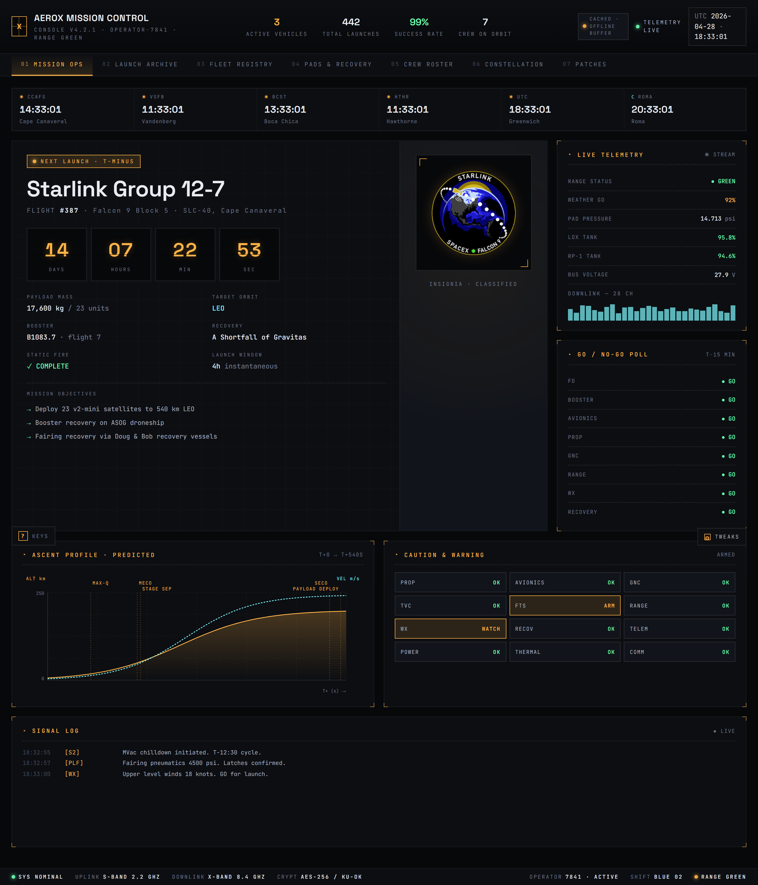](https://aero-x-eight.vercel.app/)

AeroX is a fictional ground-station console that consumes the public [r-spacex/SpaceX-API](https://github.com/r-spacex/SpaceX-API) and presents launches, fleet specs, pads, crew and the Starlink constellation through an original HUD-style interface. The visual language is intentionally *not* a copy of any real branded UI: panels with hairline corners, JetBrains Mono telemetry, Space Grotesk titling, an amber primary with ice-cyan secondaries, and red for alarms.

## Highlights

- **7 tabs**, each a focused operational view: Mission Ops, Launch Archive, Fleet Registry, Pads & Recovery, Crew Roster, Starlink Constellation, Mission Patches.
- **Animated boot sequence** on cold load — UTC stamp, init log, NOMINAL/RANGE GREEN flags.
- **Live countdown** (digit cells), **fake-real-time telemetry** (LOX, RP-1, voltage, pad pressure ticking every 1.5s), spark-line, GO/NO-GO poll.
- **WOW components**: world clock strip across 6 range sites, predicted ascent profile with annotated MAX-Q / MECO / SECO / DEPLOY events, caution-and-warning grid with blinking alarms, streaming radio chatter signal log.
- **Live SpaceX API** with 6s timeout and graceful fallback to a richer baked dataset (35 astronauts, 9 pads, 4 vehicles, 8 milestone launches up to 2025).
- **Tweaks panel** — accent theme (Amber / Phosphor / Ice), density (Compact / Comfy), CRT scanlines, audio beeps, language (EN / IT), data source (Live / Cached). All persisted to `localStorage`.
- **Audio cues** through Web Audio API: tick, second-tick, select, confirm, alarm, log.
- **Hotkeys**: `1`–`7` to switch tabs, `/` to focus search, `?` to toggle the shortcuts panel, `Esc` to close modals.
- **Bilingual UI** (English / Italian) — ~190 strings, signal-driven, no external i18n library.
- **Reduced-motion aware**, AA contrast on all foregrounds, ARIA roles on dialogs/tabs, focus-visible outlines.

## Stack

| Layer | Choice |
|---|---|
| Framework | Angular 21.2 (standalone components, zoneless, signals) |
| Language | TypeScript 5.9 strict (no `any`) |
| Styling | Tailwind v4 + custom CSS (HUD design system, ~1500 lines of tokens & components) |
| HTTP | `HttpClient` with `withFetch()`, RxJS `forkJoin` + `timeout` |
| State | Signals (`signal`, `computed`, `effect`) — no NgRx |
| Audio | Web Audio API |
| Testing | Vitest (default in v21+) + Playwright for E2E smoke |

Naming follows the v21+ convention (no `.component.ts` / `.service.ts` suffix); architecture is **Atomic Design + Feature folders + Service layer**.

## Screenshots

### Mission Ops
The hero surface: world clocks, next-launch hero with mission patch and countdown, live telemetry, GO/NO-GO poll, ascent profile, caution & warning, radio chatter.


### Launch Archive
Filterable launch history with status, vehicle, date, orbit. Click any row to open the mission record.

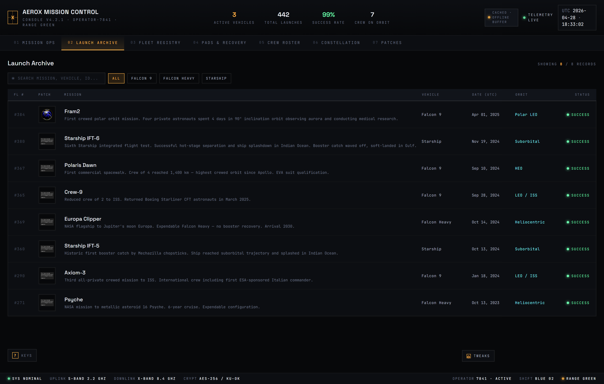

### Launch Modal
Full mission record with embedded YouTube webcast.

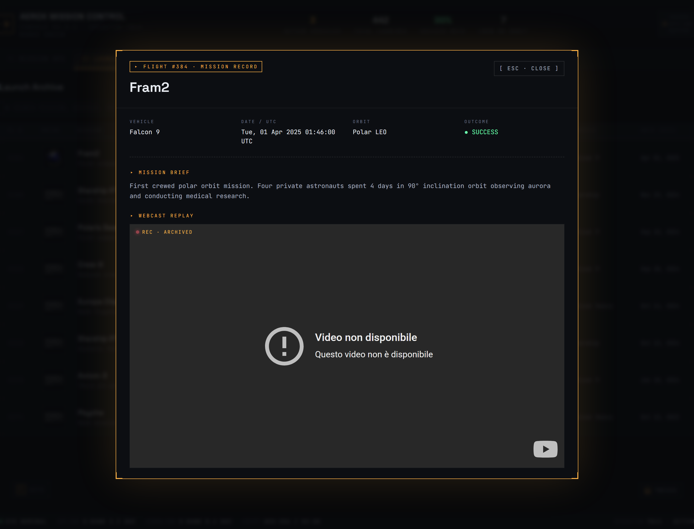

### Fleet Registry
Falcon 9, Falcon Heavy, Starship, Dragon — each rendered as a technical SVG with quotes, spec grid (height, mass, thrust, engines), and payload bars (LEO / GTO / cost).

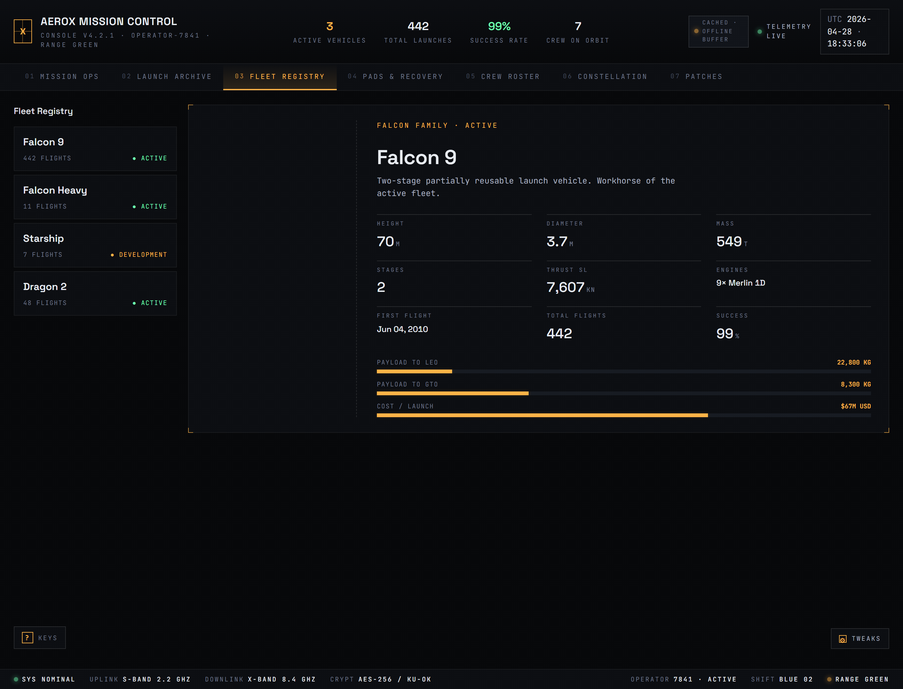

### Pads & Recovery
Equirectangular world map with pulsing pad markers, radar sweep over Cape Canaveral, side list of launch and droneship sites.

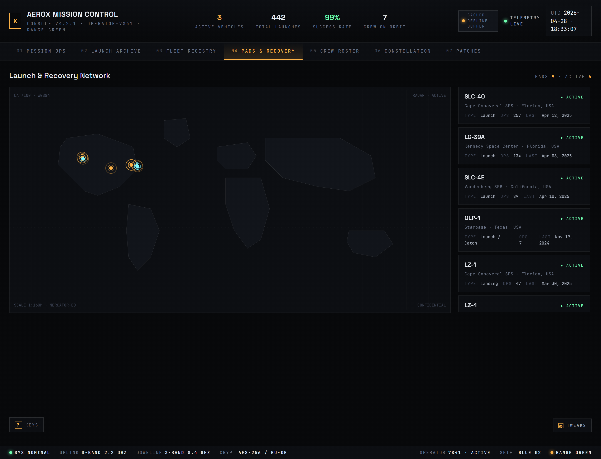

### Crew Roster
35 astronauts filterable by status (ACTIVE / TRAINING / RESERVE), agency, missions flown, last assignment.

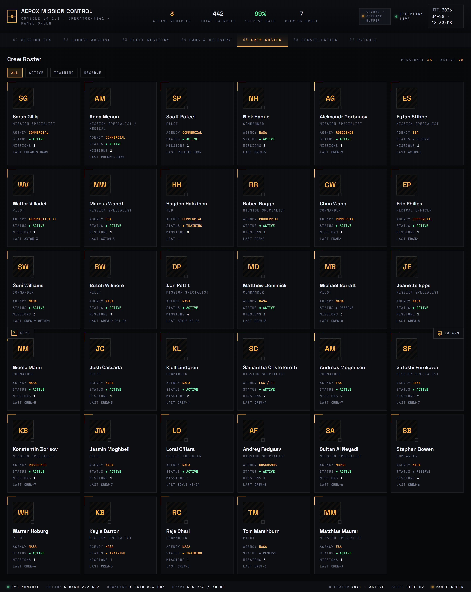

### Starlink Constellation
Animated rotating constellation around a stylized Earth, 5 orbital shells, big-stat cells (deployed / operational / coverage / subscribers).

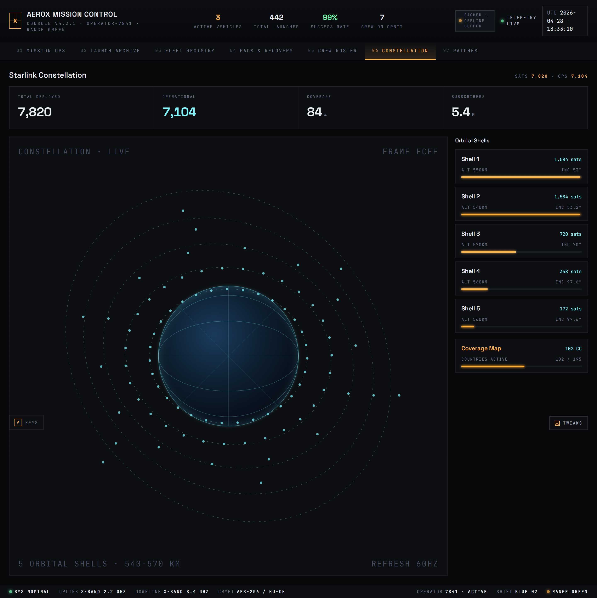

### Patches Gallery
Mission patches loaded from the API when available, with procedural fallback for missing assets.

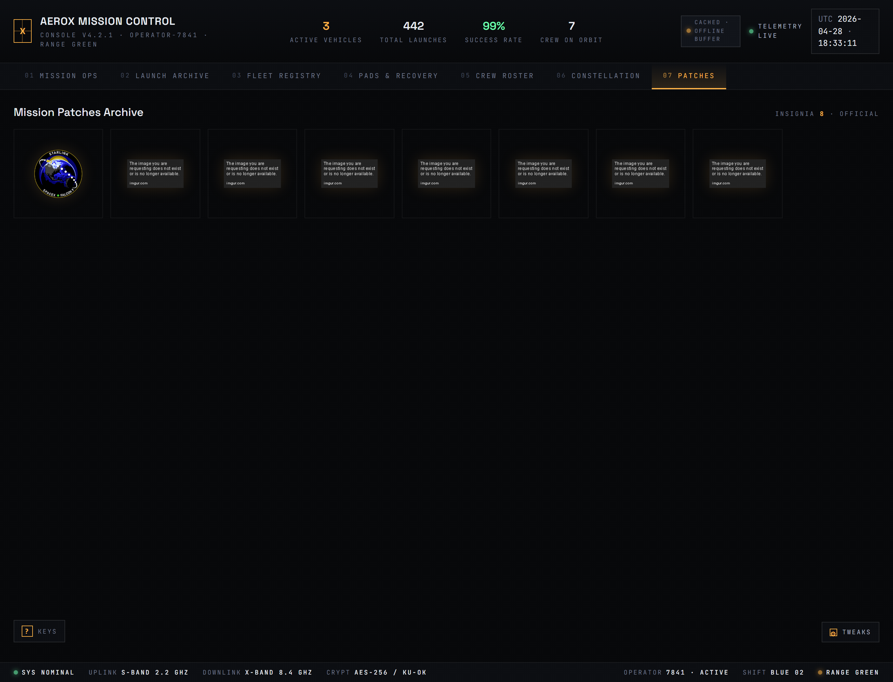

### Tweaks Panel
Live theme/density/audio/language/data-source switching. All settings persisted.

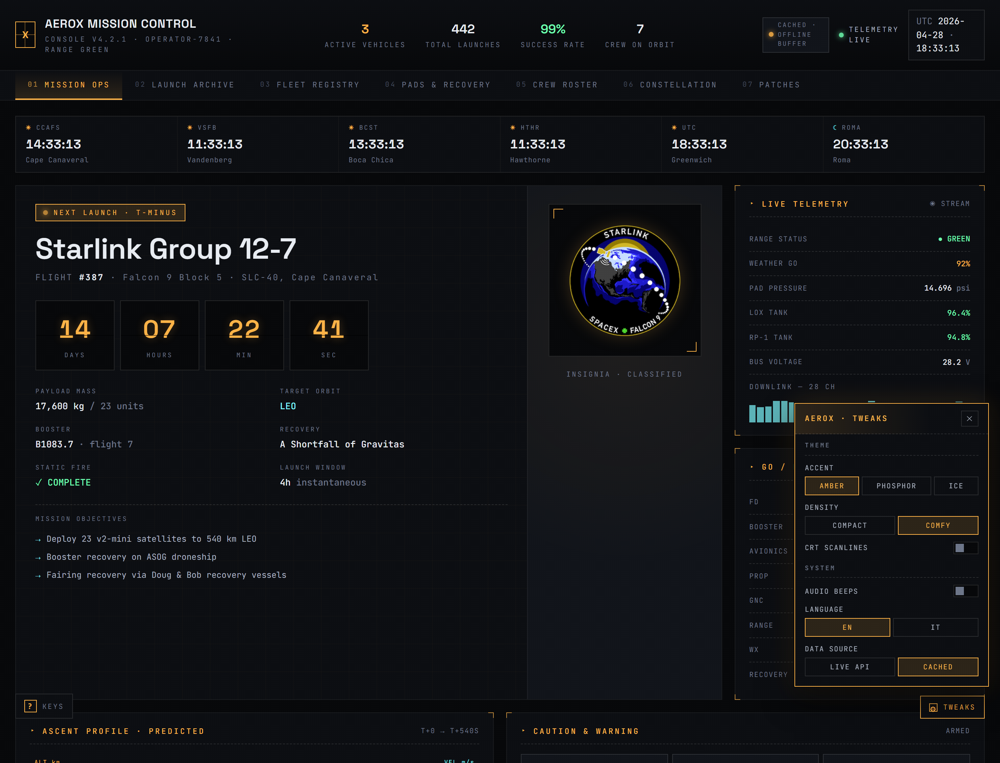

### Hotkeys Reference
Press `?` (or click `? KEYS` bottom-left) for the full shortcut sheet.

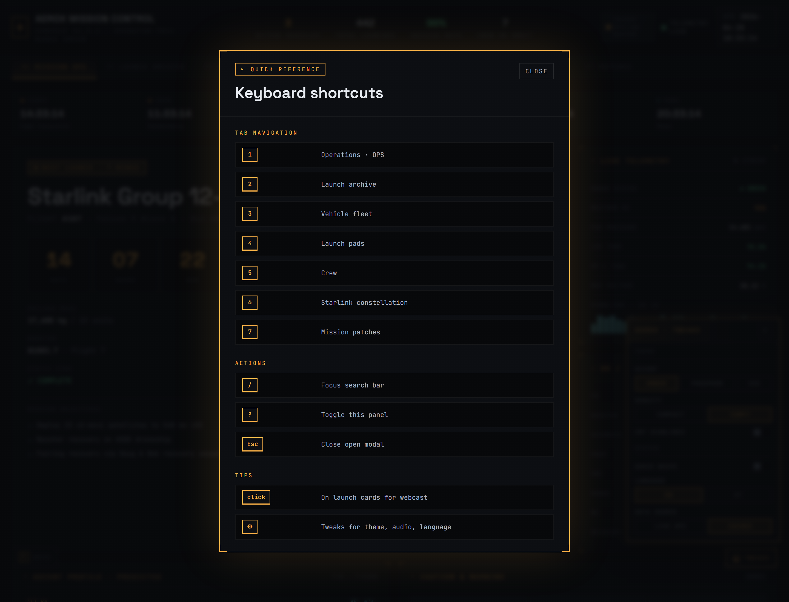

### Phosphor Green theme + CRT scanlines
The same dashboard with the Phosphor accent and scanline overlay.

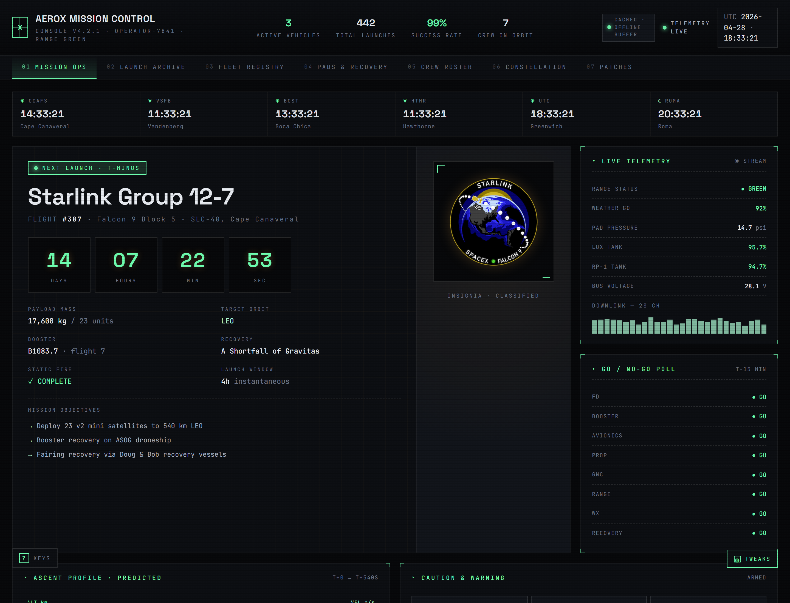

## Responsive

The dashboard adapts across the full desktop → mobile spectrum with five tuned breakpoints:

| Breakpoint | Target | Key adaptations |
|---|---|---|
| `≥ 1281px` | Desktop XL | Default layout, 320px side rails, 4-col modal grid |
| `≤ 1280px` | Small laptop | Tighter chrome, narrower hero side panel (240px), padding compression |
| `≤ 1100px` | Tablet landscape | Center stats hide, hero/pads/starlink/fleet collapse to single column, 5-col launches table |
| `≤ 900px`  | Tablet portrait | Live indicator hides, fonts shrink, modals to 2-col meta grid, smaller patch frame |
| `≤ 600px`  | Phone | Header → 3-cell strip (logo · title · clock), src-badge hides, tabs scroll-snap, countdown 4-col, world clock 2-col, alarm 2-col, big-stat 1-col, launches → 3-col (`#fl · mission · status`), modals full-bleed, statusbar shows 4/8 critical items, floating chrome → icons only |
| `≤ 380px`  | Small phone | Countdown 2×2, alarm/world-clock/specs go single column |

Plus `prefers-reduced-motion: reduce` neutralises pulses/sweeps/blinks.

| iPhone — Mission Ops | iPhone — Launch Archive | iPhone — Pads | Tablet portrait |
|---|---|---|---|
| 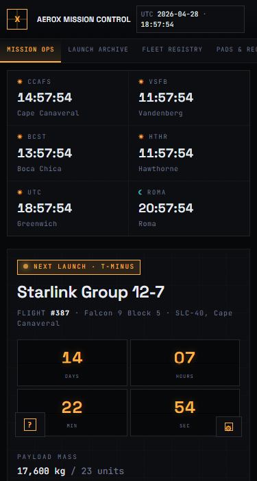 | 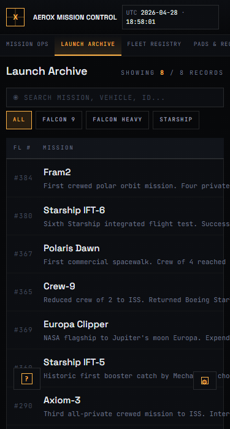 | 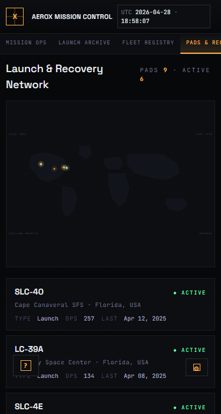 | 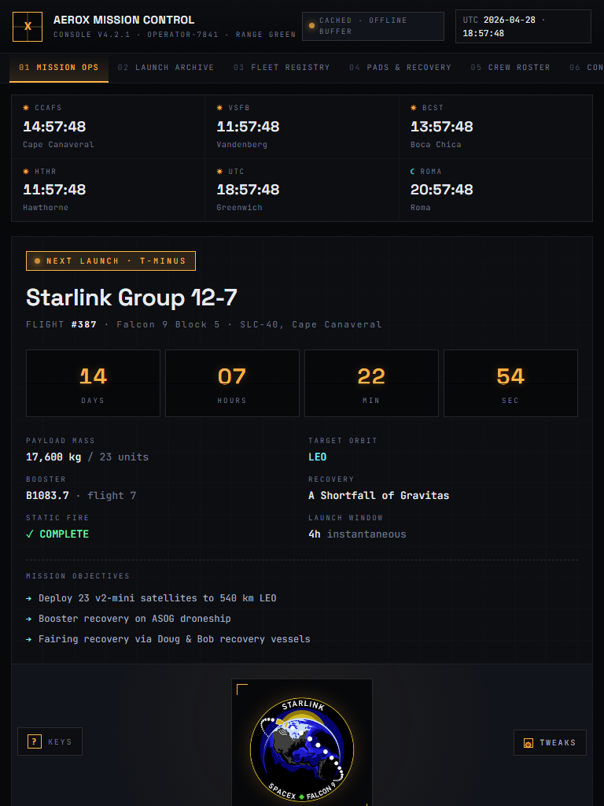 |

Verified zero horizontal overflow at 360 / 375 / 414 / 600 / 768 / 1024 / 1280 / 1440 px across every tab.

## Getting Started

> Prefer to just look around? Open the **[live preview on Vercel](https://aero-x-eight.vercel.app/)** — no install required.

Prerequisites: Node 20+ and npm 10+ (project tested on Node 22 / npm 11).

```bash
# Install dependencies
npm install

# Start the dev server (zoneless, hot reload, port 4200)
npm start

# Production build
npm run build

# Watch mode
npm run watch

# Tests
npm test
```

Then open `http://localhost:4200/`.

## Hotkeys

| Key | Action |
|---|---|
| `1` … `7` | Switch tab (Ops, Launches, Fleet, Pads, Crew, Starlink, Patches) |
| `/` | Focus the search input on the current tab |
| `?` | Toggle the shortcuts panel |
| `Esc` | Close the topmost modal |

A discoverable `? KEYS` badge sits permanently in the bottom-left.

## Project Structure

```
src/
├── index.html                  # Google Fonts, body data-attributes
├── styles.css                  # Design tokens + HUD component styles + responsive
└── app/
    ├── app.ts                  # Shell: tabs, hotkeys, data flow, modals
    ├── app.config.ts           # Zoneless, HttpClient(withFetch), router
    ├── app.routes.ts           # (single-page; reserved for future)
    │
    ├── core/
    │   ├── data/
    │   │   ├── baked-data.ts   # 35 crew, 9 pads, 4 rockets, 8 launches, 5 shells
    │   │   └── i18n-strings.ts # EN/IT dictionary (~190 strings)
    │   ├── models/             # Launch, Rocket, Pad, CrewMember, Starlink, Upcoming, Dataset, Tweaks
    │   └── services/
    │       ├── audio-cue.ts    # Web Audio beeps (tick / select / confirm / alarm)
    │       ├── clock.ts        # 1Hz Date signal
    │       ├── hotkeys.ts      # Global keyboard registry
    │       ├── i18n.ts         # Signal-driven translation
    │       ├── spacex-api.ts   # HttpClient + fallback orchestration
    │       ├── toast.ts        # Notification queue
    │       └── tweaks.ts       # Settings store + localStorage persistence
    │
    ├── shared/
    │   ├── ui/atoms/           # Dot, Panel
    │   ├── ui/molecules/       # SectionHeader
    │   └── utils/format.ts     # fmtNum, fmtDate, fmtDateTime, pad2
    │
    └── features/
        ├── boot-sequence/      # Animated console boot
        ├── header/             # Logo, stats, src badge, UTC clock
        ├── statusbar/          # Bottom RANGE GREEN strip
        ├── tweaks-panel/       # HUD-styled settings panel
        ├── hotkey-hint/        # Floating discoverability badge
        ├── hotkeys-modal/      # Shortcuts overlay
        ├── launch-modal/       # Mission record + YouTube embed
        ├── toast/              # Notification renderer
        ├── ops/                # Mission Ops tab
        │   ├── countdown/
        │   ├── telemetry-panel/
        │   ├── go-no-go/
        │   ├── world-clock/
        │   ├── ascent-profile/
        │   ├── alarm-panel/
        │   └── signal-log/
        ├── launches/
        ├── fleet/ (rocket-svg/)
        ├── pads/
        ├── crew/
        ├── starlink/
        └── patches/
```

## Data Source

By default the app fetches from `https://api.spacexdata.com/v4` (no API key required):

- `/launches/past?limit=12` — recent launches table
- `/launches/upcoming` — next launch hero (filtered to entries with future `date_utc`)
- `/rockets` — rocket name resolution

If the live request times out or fails (network down, CORS, sandbox), the client falls back to a **baked dataset** that ships with the bundle and is more current for some entities (the upstream public API is not always up-to-date — recent missions like Fram2, Polaris Dawn, IFT-5/6 only exist in the baked dataset).

You can toggle between **Live API** and **Cached** at runtime through the Tweaks panel.

## Architecture Notes

- **Zoneless** — `provideZonelessChangeDetection()` in `app.config.ts`. Every component runs `OnPush`. State changes flow through signals only.
- **No NgModules** — every component is standalone, imports are explicit.
- **No `any`** — strict TypeScript end-to-end; mapping the API to domain types happens in `spacex-api.ts`.
- **No `ngClass` / `ngStyle`** — class and style bindings everywhere.
- **No `@HostBinding` / `@HostListener`** — `host` object on the decorator (or services for global keyboard).
- **`inject()`** for all DI; services are `providedIn: 'root'`.
- **`input()` / `output()` functions** instead of decorators.
- **Native control flow** (`@if`, `@for`, `@switch`) — no structural-directive shorthand.
- **Reactive forms only** (search inputs are signal-driven; no template-driven forms).
- **WCAG AA** — focus-visible outlines on every interactive element, ARIA roles on dialogs and tab strips, AA contrast verified across all theme variants.

## Acknowledgements

- Public dataset: [r-spacex/SpaceX-API](https://github.com/r-spacex/SpaceX-API) — open-source, no API key, courtesy of the r/SpaceX community.
- Mission patches: hot-linked from public Imgur albums when an API URL is provided.
- AeroX is a fictional ops centre. No SpaceX trademarks, logos, or proprietary copy are used.

## License

Internal / personal project — no license declared.
